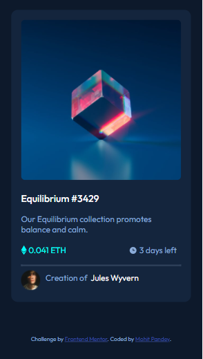

# Frontend Mentor - NFT preview card component solution

This is a solution to the [NFT preview card component challenge on Frontend Mentor](https://www.frontendmentor.io/challenges/nft-preview-card-component-SbdUL_w0U).


## Table of contents

- [Overview](#overview)
  - [Screenshot](#screenshot)
  - [Links](#links)
- [My process](#my-process)
  - [Built with](#built-with)
  - [What I learned](#what-i-learned)
  - [Continued development](#continued-development)
  - [Useful resources](#useful-resources)
- [Author](#author)
- [Acknowledgments](#acknowledgments)

**Note: Delete this note and update the table of contents based on what sections you keep.**

## Overview

Built a NFT preview card component using HTML & CSS to get a hang of HTML & CSS. I have tried to build it as close as possible to screenshot shared by Frontend Mentor.  

### Screenshot

**Desktop View**


**Mobile View**



**Active State**


### Links

- Solution URL: [https://www.frontendmentor.io/solutions/responsive-qr-code-using-html-and-css-ByzEWgFfq](https://www.frontendmentor.io/solutions/responsive-qr-code-using-html-and-css-ByzEWgFfq)
- Live Site URL: [https://mohit1397.github.io/qr-code-card/](https://mohit1397.github.io/qr-code-card/)

## My process

### Built with

- Semantic HTML5 markup
- CSS custom properties
- Flexbox


### What I learned

The image overlay was getting messed up during hovering as per the design, and after surfing almost about everything I understood about flexbox and transform element in CSS which basically helped me with the position on the element.

Here's the code snippet for flexbox and transform element which I have used

```css
.view-overlay {
    width: 100%;
    height: 100%;
    border-radius: 0.8rem;
    position: absolute;
    top: 50%;
    left: 50%;
    background: hsl(178, 100%, 50%, 50%);
    opacity: 0;
    display: flex;
    transform: translate(-50%,-50%);

}
```

### Continued development

I want to try and apply different scripts once I have learned JS. 

### Useful resources

- [flexbox](https://www.w3schools.com/css/css3_flexbox.asp) - This helped me to apply position my view(eye) image element according the NFT image.
- [transform](https://www.w3schools.com/css/css3_2dtransforms.asp) - This helped me to apply move view(eye) image element to the center with respect to the NFT image.

## Author

- Website - [Mohit Pandey](https://mohit1397.github.io/resume/)
- Frontend Mentor - [@Mohit1397](https://www.frontendmentor.io/profile/Mohit1397)
- Twitter - [@mohitpandey1397](https://twitter.com/mohitpandey1397)